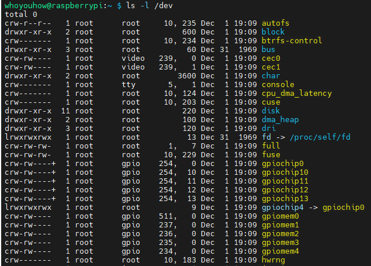

# Chapter 3: Char Drivers

## Major and Minor Numbers

using ls -l /dev command can see char type, block type devices, and major number, minor number

major number : 傳統上用來標示 device 所連接的 driver，現代 Linux kernel 允許多的 driver 共享 major number，但大部分 device 仍按照一個 major number 一個 driver來組織。

Major number — 識別 driver 類型（或 driver 的入口）

minor number : 被 kernel 用來決定要使用?(referred to)哪個 device。

Minor number — driver 內部定義的「裝置實例識別」

重點：major 是 kernel 路由 (dispatch) 的依據 — 當 user-space open(/dev/foo) 時，VFS 讀到 inode 的 device number (major, minor)，就用 major 找到要呼叫哪個 driver 的入口。

Kernel 對 minor 的理解非常淺：它只是個整數，kernel 不知道「這個 minor 代表什麼硬體」，除非是某些標準化的子系統（例如 block partitioning 有慣例）。

所以 driver 寫法通常會把 minor 當 index 去 lookup 自己維護的資料結構（或把 cdev 嵌入 device struct，open 時由 inode->i_cdev 反推 device pointer）。

## The Internal Representation of Device Numbers
pwd : /lib/modules/6.12.47+rpt-rpi-2712/source/include/linux

dev_t type (defined in <linux/types.h>) used to hold devices number.

defined in <linux/kdev_t.h>,
if wants to get major number of device number, use
- MAJOR(dev_t dev);

if wants to get minor number of device number, use
- MINOR(dev_t dev);

and if have major and minor numbers and need to turn them into a dev_t, use
- MKDEV(int major, int minor);

## Allocating and Freeing Device Numbers
if wants to set up a char device, knows device number and wants to use constant major number, can use 
- int register_chrdev_region(dev_t first, unsigned int count, char *name);
    - first is the beginning device number of the range you would like to allocate
        - minor is often 0.
    - count is the total number of devices number you are requesting.
    - name is the name of the device, will appear in /proc/devices and sysfs.
or if doesn't know device number and wants to set up a char device with dynamic device number, can use
- int alloc_chrdev_region(dev_t *dev, unsigned int firstminor, unsigned int count, char *name);
    - *dev is an output-only parameter
    - firstminor is often 0.

free device with device number
- void unregister_chrdev_region(dev_t first, unsigned int count);

## Dynamic Allocation of Major Numbers
scull_load script can dynamically create device node(files) in /dev after insmod kernel module by reading device number from /proc/devices using like awk command.